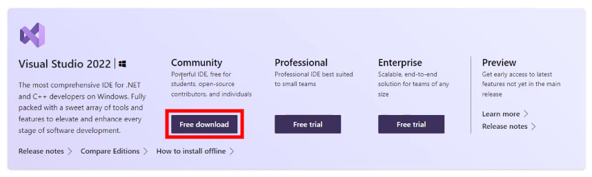
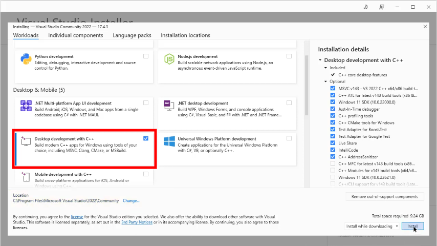
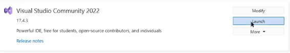
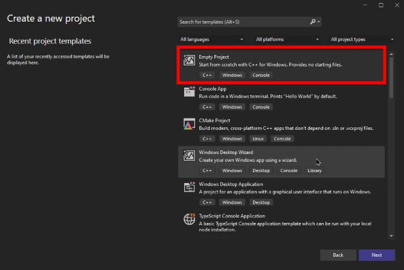

# Installing Visual Studio IDE

In this section, we'll guide you through the simple steps of installing Visual Studio IDE on your machine. Buckle up and let's get started!

## Download the Installer
First things first - head over to the [Visual Studio download page](https://visualstudio.microsoft.com/downloads/) and select the edition that suits you best. For beginners, we recommend **Visual Studio Community**, which is free for individual developers, open-source projects, academic research, education, and small professional teams.

Click on "Free download" for Visual Studio Community Edition and save the installer file on your computer.

## Run the Installer
Locate the downloaded installer file (usually in your Downloads folder) and double-click it to run. A User Account Control prompt may appear asking if you want to allow the app to make changes to your device; click "Yes."

## Customize Your Installation
Once the installer starts, it'll present a list of workloads (a set of features tailored for specific development tasks). Find and select "**Desktop development with C++**" - this includes everything you need for C++ programming.

Feel free to explore other workloads too! If you're interested in game development or cross-platform mobile development, Visual Studio has got you covered.

After selecting workloads, click on "**Install**" at the bottom right corner of the installer window. Grab a cup of coffee while Visual Studio installs all necessary components!

## Launch Visual Studio IDE
When the installation is complete, click on "**Launch**" to start Visual Studio IDE. It'll open a welcome screen where you can sign in with your Microsoft account or create one. Signing in helps synchronize your settings and preferences across devices.

## Create Your First C++ Project
Congratulations! You've successfully installed Visual Studio IDE, and now it's time to create your first C++ project:

1. Click on "**Create a new project**" from the Welcome screen.
2. Choose "**Empty Project**" under the "C++" filter, then click "Next."
3. Give your project a name and choose a location to save it.
4. Click on "Create."

You're all set! Now go ahead and write your first lines of C++ code in the `Source Files` folder by creating a new `.cpp` file. The world of programming awaits!
