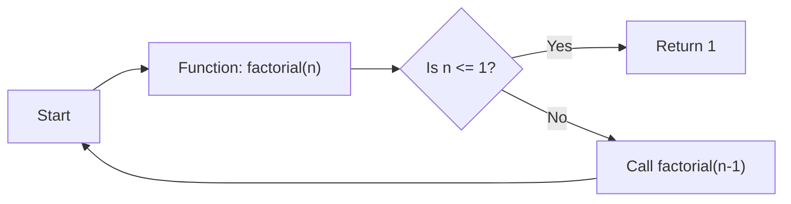

# Recursion

Recursion occurs when a function calls itself directly or indirectly. It's like inception but for functions!

~~~admonish example title="Factorial illustration"
A good example for this is the factorial function.

~~~

Imagine you're climbing a staircase, and at each step, you can either take one or two steps. How many ways are there to reach the top? This problem can be elegantly solved using recursion!

Here's how we might write this function in C++:

```cpp
int countWays(int n) {
    // Base case: If there are no more steps left, we found one way!
    if (n == 0) return 1;

    // Base case: If there are negative steps left, there's no valid way.
    if (n < 0) return 0;

    // Recursive case: Count ways by taking one step or two steps.
    return countWays(n - 1) + countWays(n - 2);
}
```

~~~admonish example title="With iteration" collapsible=true
```cpp
int countWays(int n) {
    if (n == 0) return 1;
    if (n < 0) return 0;
    
    int a = 1, b = 0, temp;
    
    for (int i = 1; i <= n; ++i) {
        temp = a;
        a = a + b;
        b = temp;
    }
    
    return a;
}
```
~~~

## The Anatomy of a Recursive Function

A successful recursive function must have two essential parts:

1. **Base Case(s):** A condition where the function stops calling itself and returns a value directly. These cases prevent infinite loops and provide concrete solutions for the smallest possible sub-problems.
2. **Recursive Case(s):** A condition where the function calls itself with modified arguments to solve smaller instances of the problem.

Let's dissect our `countWays` function to see these parts in action:

- Base Cases:
  - `if (n == 0) return 1;`: If there are no more steps left, we found one way.
  - `if (n < 0) return 0;`: If there are negative steps left, there's no valid way.

- Recursive Case:
  - `return countWays(n - 1) + countWays(n - 2);`: Count ways by taking one step or two steps. Notice how the problem size decreases with each call!

## Recursion vs. Iteration

Recursion and iteration (loops) can often be used interchangeably to solve problems. While recursion may provide a more elegant and intuitive solution, it can also lead to performance issues if not implemented carefully.

In some cases, recursion may cause a significant amount of overhead due to function calls, resulting in a slower solution compared to an iterative approach. However, this can often be mitigated through optimization techniques like memoization.