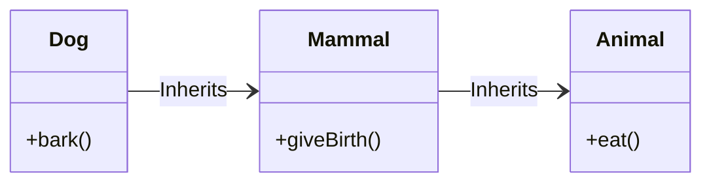

# Multilevel Inheritance

Multilevel inheritance is a concept in OOP where a class inherits from another class, which is itself a derived class of some other base class. It allows us to create new classes that share characteristics and behavior of multiple parent classes, following the "is-a" relationship.

In simple words, imagine multilevel inheritance as a family tree - just like how you inherit properties from both your parents and grandparents.

## Simple Multilevel Inheritance

Let's consider an example where we have three classes: `Animal`, `Mammal`, and `Dog`. The `Animal` class is our base (top-level) class, followed by the `Mammal` derived class, and finally, the `Dog` derived class at the bottom level.



~~~admonish example
```cpp,editable
#include <iostream>

// Base Class
class Animal {
public:
    void eat() {
        std::cout << "Eating..." << std::endl;
    }
};

// Derived Class 1
class Mammal : public Animal {
public:
    void giveBirth() {
        std::cout << "Giving birth..." << std::endl;
    }
};

// Derived Class 2
class Dog : public Mammal {
public:
    void bark() {
        std::cout << "Barking..." << std::endl;
    }
};

int main() {
    Dog dog;
    dog.eat();        // Inherited from Animal class
    dog.giveBirth();  // Inherited from Mammal class
    dog.bark();       // Member of Dog class

    return 0;
}
```
In this example, the `Dog` class inherits properties and behavior from both `Animal` and `Mammal` classes through multilevel inheritance.
~~~

## Multilevel Inheritance with Constructors

Let's consider another example where we have three classes: `Person`, `Employee`, and `Manager`. The constructors in each class will help us understand the order of execution during object instantiation.

~~~admonish example
```cpp,editable
#include <iostream>

// Base Class
class Person {
public:
    Person() {
        std::cout << "Constructor of Person" << std::endl;
    }
};

// Derived Class 1
class Employee : public Person {
public:
    Employee(std::string_view company) {
        std::cout << "Constructor of Employee for Company: " << company << std::endl;
    }
};

// Derived Class 2
class Manager : public Employee {
public:
    Manager() : Employee("Apple") {
        std::cout << "Constructor of Manager" << std::endl;
    }
};

int main() {
    Manager manager;  // Instantiate an object of Manager class

    return 0;
}
```

In this example, the order in which constructors are called follows the hierarchy from top to bottom. The base class constructor is called first (`Person`), followed by the derived class constructors (`Employee` and then `Manager`). Also note how you would call a constructor with arguments for a base class.
~~~